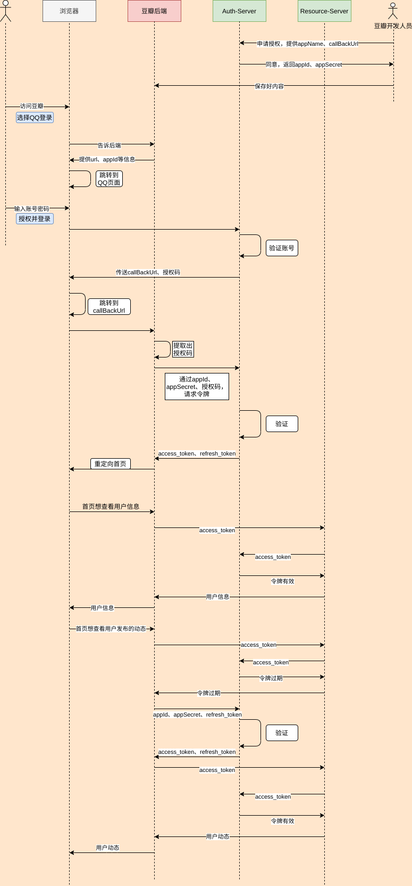

### 简介
本示例模仿搭建一个OAuth平台，以及一个第三方请求授权的流程。

授权模式采用较为常用的授权码模式，不过并没有严格按RFC6749要求的参数走
### 容易遇到的问题
- 跨域请求
- access_token过期
### 交互图

### 参考资料
http://tutorials.jenkov.com/oauth2/index.html

http://www.ruanyifeng.com/blog/2019/04/oauth-grant-types.html

http://www.ruanyifeng.com/blog/2019/04/github-oauth.html

https://www.cnblogs.com/flashsun/p/7424071.html#!comments

https://tools.ietf.org/html/rfc6749

https://wiki.connect.qq.com/%E5%87%86%E5%A4%87%E5%B7%A5%E4%BD%9C_oauth2-0
